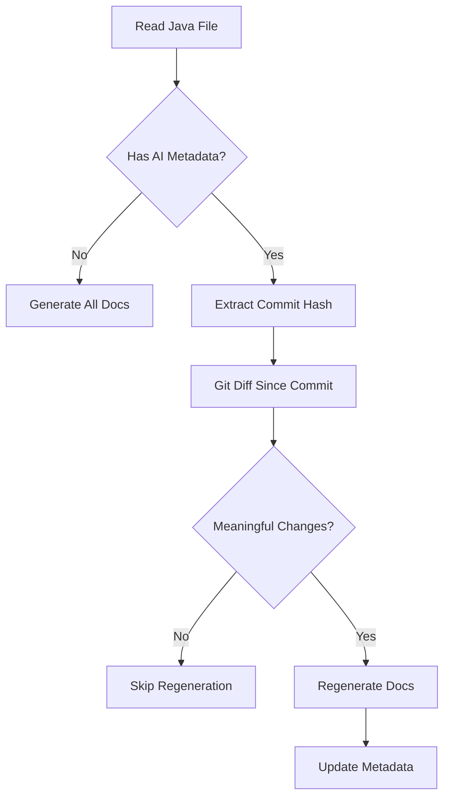

# JavadocGithubAction

An intelligent GitHub Action that automatically generates and maintains comprehensive Javadoc comments using Claude AI.

## Core Philosophy: API Contract Documentation

This tool focuses on generating comprehensive **Javadoc comments** that document the public API contract:

- What the method/class does (not implementation details)
- Parameters and their purpose  
- Return values and their meaning
- Exceptions that can be thrown
- Usage examples when helpful
- Cross-references to related classes/methods

```java
/**
 * Validates and processes user authentication credentials.
 * 
 * This method performs a secure authentication check against the configured
 * authentication provider and returns a session token for successful logins.
 * 
 * @param username The username to authenticate (must not be null or empty)
 * @param password The password to verify (must not be null)
 * @return An authenticated session token valid for the current session
 * @throws AuthenticationException if credentials are invalid or user is locked
 * @throws RateLimitException if too many authentication attempts have been made
 * @throws IllegalArgumentException if username or password is null/empty
 * @see SessionToken
 * @since 1.0
 */
public String authenticate(String username, String password) {
    // ... implementation ...
}
```

### Why Focus on Javadoc Only

- **API consumers** need clear documentation of what methods do and how to use them
- **Implementation details** belong in regular code comments written by developers
- **Javadoc** serves as both documentation and IDE integration for better development experience
- **Contract focus** ensures documentation remains stable as implementation changes

## Smart Regeneration System

The tool includes an intelligent regeneration system that only updates documentation when necessary:

### How It Works

1. **Existing Documentation Detection**: Checks if Javadoc already exists for methods and classes
2. **Quality Assessment**: Evaluates existing Javadoc to determine if it needs improvement
3. **Selective Processing**: Only processes items that lack documentation or have poor quality docs

### What Triggers Regeneration

**Always regenerated**:
- Methods/classes with no existing Javadoc
- Javadoc with placeholder content (TODO, FIXME, generic descriptions)
- Javadoc missing essential tags (@param, @return, @throws)

**Preserved**:
- Existing high-quality Javadoc documentation
- Human-written documentation that follows proper conventions

This approach minimizes unnecessary API calls while ensuring comprehensive documentation coverage.

## Documentation Review Mode

When regenerating existing Javadoc, the tool preserves the old documentation for human review. This allows you to verify that updates are improvements rather than unnecessary changes.

### How It Works

When documentation is regenerated, the output includes:
1. **New documentation** - The updated Javadoc comment at the top
2. **Old documentation** - The previous version below, prefixed with `//OLD` on each line

### Example Output

```java
    /**
     * Validates and processes user authentication credentials with enhanced security.
     *
     * This method performs multi-factor authentication checks and rate limiting
     * before validating credentials against the configured authentication provider.
     *
     * @param username The username to authenticate (must not be null or empty)
     * @param password The password to verify (must not be null)
     * @return An authenticated session token valid for 24 hours
     * @throws AuthenticationException if credentials are invalid or user is locked
     * @throws RateLimitException if too many authentication attempts have been made
     * @throws IllegalArgumentException if username or password is null/empty
     */
    //OLD /**
    //OLD  * Validates user credentials.
    //OLD  *
    //OLD  * @param username The username
    //OLD  * @param password The password
    //OLD  * @return A session token
    //OLD  * @throws AuthenticationException if credentials are invalid
    //OLD  */
    public String authenticate(String username, String password) {
        // ... implementation ...
    }
```

### Benefits

- **Quality Control**: Human reviewers can easily compare old vs new documentation
- **Audit Trail**: Understand what changed and why
- **Easy Cleanup**: After review, simply remove the `//OLD` lines you don't need
- **Non-Breaking**: Old documentation is commented out, so it doesn't affect compilation

### Reviewing Changes

After regeneration, review the changes:

1. **Compare**: Look at the new documentation vs the `//OLD` version
2. **Evaluate**: Determine if the update improved accuracy and clarity
3. **Clean Up**: Remove `//OLD` lines once satisfied with the changes
4. **Revert**: If the new version isn't better, restore from the `//OLD` version

```bash
# Search for all files with review markers
grep -r "//OLD" src/

# View changes in a specific file
cat MyClass.java | grep -A5 -B5 "//OLD"
```

## Quick Start

### Installation

```bash
# Clone the repository
git clone https://github.com/yourusername/JavadocGithubAction.git

# Install dependencies
pip install -r scripts/github_action_javadoc/requirements.txt

# Set your API key
export ANTHROPIC_API_KEY="your-key-here"
```

### Basic Usage

```bash
# Generate docs for a single file
python3 scripts/github_action_javadoc/generate_javadoc_smart.py src/MyClass.java

# Smart mode - only regenerate changed methods
python3 scripts/github_action_javadoc/generate_javadoc_smart.py src/MyClass.java --smart

# Adjust sensitivity threshold
python3 scripts/github_action_javadoc/generate_javadoc_smart.py src/MyClass.java --smart --threshold 10
```

## How It Works

### Generation Process

1. **Parsing**: Analyzes Java file structure using AST parsing
2. **Context Gathering**: Understands class relationships and dependencies
3. **Contract Generation**: Creates Javadoc for public API
4. **Implementation Analysis**: Identifies complex logic needing explanation
5. **Metadata Embedding**: Adds tracking information for smart regeneration

### Smart Regeneration Process



## Example Output

Here's what the tool generates for a complex method:

```java
/**
 * Finds the shortest path between two nodes in the graph using Dijkstra's algorithm.
 * 
 * This method computes the minimum-weight path from the source node to the 
 * destination node, considering edge weights as distances.
 * 
 * @param source The starting node identifier
 * @param destination The target node identifier
 * @param maxDistance Optional maximum distance constraint (use -1 for unlimited)
 * @return A Path object containing the route and total distance, or null if unreachable
 * @throws IllegalArgumentException if source or destination nodes don't exist
 * @throws GraphNotConnectedException if the graph has disconnected components
 * 
 * @see Path
 * @see #addEdge(String, String, double)
 * @since 2.0
 */
// AI Implementation: Uses a binary heap priority queue for O(E log V) complexity.
// Maintains a distance map and previous node map for path reconstruction.
// Early termination when destination is reached optimizes average case.
// The maxDistance parameter enables radius-limited searches for performance.
// Comments AI generated: 2025-01-15T10:00:00Z | Commit: 7a8b9c0
public Path findShortestPath(String source, String destination, double maxDistance) {
    // ... implementation ...
}
```

## GitHub Actions Integration

### Automatic PR Documentation

Add to `.github/workflows/javadoc_smart.yml`:

```yaml
name: Generate Javadoc
on:
  pull_request:
    types: [opened, synchronize]
    
jobs:
  generate-docs:
    runs-on: ubuntu-latest
    steps:
      - uses: actions/checkout@v2
      - name: Generate Javadoc
        run: python3 scripts/github_action_javadoc/action.py
        env:
          ANTHROPIC_API_KEY: ${{ secrets.ANTHROPIC_API_KEY }}
```

The action will:
1. Detect changed Java files in the PR
2. Apply smart regeneration to modified methods
3. Commit updates back to the PR
4. Show cost savings in commit message

## Configuration

### Customizing Documentation Style

Edit `scripts/github_action_javadoc/CUSTOMER-PROMPT.md`:

```markdown
# Documentation Guidelines

## Javadoc Style
- Focus on the contract, not implementation
- Use active voice
- Include examples for complex APIs
- Document all exceptions

## Implementation Comments
- Explain algorithm choices
- Note performance characteristics  
- Document trade-offs
- Reference design patterns used
```

### Threshold Settings

Control regeneration sensitivity:

| Threshold | Use Case | Regeneration Frequency |
|-----------|----------|------------------------|
| 1 | Critical code, high accuracy needed | Very frequent |
| 3 | Default - balanced approach | Moderate |
| 10 | Stable code, cost-sensitive | Infrequent |
| 20+ | Very stable code, minimal changes | Rare |

## Cost Analysis

### Traditional Approach
- 100 methods in codebase
- Every PR regenerates all: ~$2.50 per PR
- 10 PRs per day: ~$25/day

### With Smart Regeneration  
- Average 5 methods changed per PR
- Only those regenerated: ~$0.125 per PR
- 10 PRs per day: ~$1.25/day
- **95% cost reduction**

## Advanced Features

### Bulk Processing

```bash
# Process entire codebase
find src -name "*.java" | while read file; do
    python3 scripts/github_action_javadoc/generate_javadoc_smart.py "$file" --smart
done

# Only undocumented files
for file in $(find src -name "*.java"); do
    if ! grep -q "/\*\*" "$file"; then
        python3 scripts/github_action_javadoc/generate_javadoc_smart.py "$file"
    fi
done
```

### CI/CD Integration

```bash
# Pre-commit hook
#!/bin/bash
changed_files=$(git diff --cached --name-only --diff-filter=ACM | grep '\.java$')
for file in $changed_files; do
    python3 scripts/github_action_javadoc/generate_javadoc_smart.py "$file" --smart --threshold 5
    git add "$file"
done
```

## Troubleshooting

| Issue | Cause | Solution |
|-------|-------|----------|
| No output | File already documented | Use `--smart` flag or remove docs first |
| Git errors | Not in git repo | Run `git init` or disable smart mode |
| All skipped | Changes below threshold | Lower threshold with `--threshold 1` |
| API errors | Invalid key | Check `ANTHROPIC_API_KEY` environment variable |

## Contributing

We welcome contributions! Key areas:

- **Parsing improvements** in `javadoc_common.py`
- **Smarter diff analysis** in `generate_javadoc_smart.py`  
- **Prompt engineering** in `CUSTOMER-PROMPT.md`
- **Language support** (Kotlin, Scala, etc.)

## License

MIT License - See [LICENSE](LICENSE) file

## Support

- **Issues**: [GitHub Issues](https://github.com/yourusername/JavadocGithubAction/issues)
- **Discussions**: [GitHub Discussions](https://github.com/yourusername/JavadocGithubAction/discussions)
- **Wiki**: [Documentation Wiki](https://github.com/yourusername/JavadocGithubAction/wiki)

## Acknowledgments

- Built with [Claude AI](https://claude.ai) by Anthropic
- Java parsing via [javalang](https://github.com/c2nes/javalang) library
- Inspired by the need for better documentation practices
