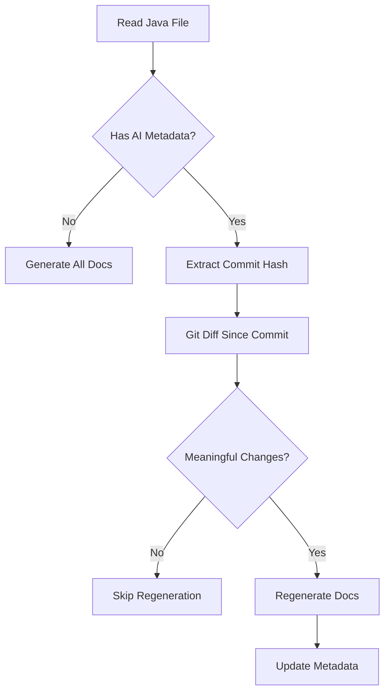

# JavadocGithubAction

An intelligent GitHub Action that automatically generates and maintains Javadoc comments using Claude AI, with smart regeneration to minimize API costs.

## Core Philosophy: Separation of Contract and Implementation

This tool follows a key principle: **Javadoc documents the contract, not the implementation**.

### What Gets Generated

The tool generates two distinct types of documentation:

#### 1. Javadoc Comments (The Contract)
Standard Javadoc that documents the **public API contract**:
- What the method/class does (not how)
- Parameters and their purpose
- Return values
- Exceptions that can be thrown
- Usage examples when helpful

```java
/**
 * Validates and processes user authentication credentials.
 * 
 * @param username The username to authenticate
 * @param password The password to verify  
 * @return An authenticated session token
 * @throws AuthenticationException if credentials are invalid
 * @throws RateLimitException if too many attempts
 */
public String authenticate(String username, String password) {
    // ... implementation ...
}
```

#### 2. AI Implementation Comments (The How)
Separate comments that explain **complex implementation details**:
- Algorithm choices and trade-offs
- Performance optimizations
- Why certain approaches were taken
- Non-obvious technical decisions

```java
// AI Implementation: Uses bcrypt with cost factor 12 for password hashing.
// Implements exponential backoff for rate limiting with Redis backend.
// Session tokens are JWT with 15-minute expiry, refreshed on each request.
// Comments AI generated: 2025-01-15T10:00:00Z | Commit: abc123
```

### Why This Separation Matters

- **Javadoc** is for API users - they need to know what your code does, not how
- **Implementation comments** are for maintainers - they need to understand the how and why
- This separation keeps documentation focused and relevant for each audience

## Smart Regeneration System

### The Hash Tracking Mechanism

Every AI-generated implementation comment includes metadata:
```
// Comments AI generated: 2025-01-15T10:00:00Z | Commit: abc123
```

This metadata enables intelligent regeneration:
1. **Commit Hash**: Links documentation to specific code version
2. **Timestamp**: Shows when documentation was generated
3. **Git Diff Analysis**: Detects what changed since last generation

When you run smart regeneration, the tool:
```bash
# 1. Checks the embedded commit hash
# 2. Runs git diff since that commit  
# 3. Analyzes if changes are meaningful
# 4. Only regenerates if needed
```

### What Triggers Regeneration

**Meaningful changes** (regenerated):
- Logic changes
- New code paths
- Algorithm modifications
- Method signature changes

**Trivial changes** (skipped):
- Comment additions
- Whitespace/formatting
- Moving braces
- Variable renames (usually)

This approach can reduce API costs by 90-95% in typical development.

## Quick Start

### Installation

```bash
# Clone the repository
git clone https://github.com/yourusername/JavadocGithubAction.git

# Install dependencies
pip install -r scripts/github_action_javadoc/requirements.txt

# Set your API key
export ANTHROPIC_API_KEY="your-key-here"
```

### Basic Usage

```bash
# Generate docs for a single file
python3 scripts/github_action_javadoc/generate_javadoc_smart.py src/MyClass.java

# Smart mode - only regenerate changed methods
python3 scripts/github_action_javadoc/generate_javadoc_smart.py src/MyClass.java --smart

# Adjust sensitivity threshold
python3 scripts/github_action_javadoc/generate_javadoc_smart.py src/MyClass.java --smart --threshold 10
```

## How It Works

### Generation Process

1. **Parsing**: Analyzes Java file structure using AST parsing
2. **Context Gathering**: Understands class relationships and dependencies
3. **Contract Generation**: Creates Javadoc for public API
4. **Implementation Analysis**: Identifies complex logic needing explanation
5. **Metadata Embedding**: Adds tracking information for smart regeneration

### Smart Regeneration Process



## Example Output

Here's what the tool generates for a complex method:

```java
/**
 * Finds the shortest path between two nodes in the graph using Dijkstra's algorithm.
 * 
 * This method computes the minimum-weight path from the source node to the 
 * destination node, considering edge weights as distances.
 * 
 * @param source The starting node identifier
 * @param destination The target node identifier
 * @param maxDistance Optional maximum distance constraint (use -1 for unlimited)
 * @return A Path object containing the route and total distance, or null if unreachable
 * @throws IllegalArgumentException if source or destination nodes don't exist
 * @throws GraphNotConnectedException if the graph has disconnected components
 * 
 * @see Path
 * @see #addEdge(String, String, double)
 * @since 2.0
 */
// AI Implementation: Uses a binary heap priority queue for O(E log V) complexity.
// Maintains a distance map and previous node map for path reconstruction.
// Early termination when destination is reached optimizes average case.
// The maxDistance parameter enables radius-limited searches for performance.
// Comments AI generated: 2025-01-15T10:00:00Z | Commit: 7a8b9c0
public Path findShortestPath(String source, String destination, double maxDistance) {
    // ... implementation ...
}
```

## GitHub Actions Integration

### Automatic PR Documentation

Add to `.github/workflows/javadoc_smart.yml`:

```yaml
name: Generate Javadoc
on:
  pull_request:
    types: [opened, synchronize]
    
jobs:
  generate-docs:
    runs-on: ubuntu-latest
    steps:
      - uses: actions/checkout@v2
      - name: Generate Javadoc
        run: python3 scripts/github_action_javadoc/action.py
        env:
          ANTHROPIC_API_KEY: ${{ secrets.ANTHROPIC_API_KEY }}
```

The action will:
1. Detect changed Java files in the PR
2. Apply smart regeneration to modified methods
3. Commit updates back to the PR
4. Show cost savings in commit message

## Configuration

### Customizing Documentation Style

Edit `scripts/github_action_javadoc/CUSTOMER-PROMPT.md`:

```markdown
# Documentation Guidelines

## Javadoc Style
- Focus on the contract, not implementation
- Use active voice
- Include examples for complex APIs
- Document all exceptions

## Implementation Comments
- Explain algorithm choices
- Note performance characteristics  
- Document trade-offs
- Reference design patterns used
```

### Threshold Settings

Control regeneration sensitivity:

| Threshold | Use Case | Regeneration Frequency |
|-----------|----------|------------------------|
| 1 | Critical code, high accuracy needed | Very frequent |
| 3 | Default - balanced approach | Moderate |
| 10 | Stable code, cost-sensitive | Infrequent |
| 20+ | Very stable code, minimal changes | Rare |

## Cost Analysis

### Traditional Approach
- 100 methods in codebase
- Every PR regenerates all: ~$2.50 per PR
- 10 PRs per day: ~$25/day

### With Smart Regeneration  
- Average 5 methods changed per PR
- Only those regenerated: ~$0.125 per PR
- 10 PRs per day: ~$1.25/day
- **95% cost reduction**

## Advanced Features

### Bulk Processing

```bash
# Process entire codebase
find src -name "*.java" | while read file; do
    python3 scripts/github_action_javadoc/generate_javadoc_smart.py "$file" --smart
done

# Only undocumented files
for file in $(find src -name "*.java"); do
    if ! grep -q "/\*\*" "$file"; then
        python3 scripts/github_action_javadoc/generate_javadoc_smart.py "$file"
    fi
done
```

### CI/CD Integration

```bash
# Pre-commit hook
#!/bin/bash
changed_files=$(git diff --cached --name-only --diff-filter=ACM | grep '\.java$')
for file in $changed_files; do
    python3 scripts/github_action_javadoc/generate_javadoc_smart.py "$file" --smart --threshold 5
    git add "$file"
done
```

## Troubleshooting

| Issue | Cause | Solution |
|-------|-------|----------|
| No output | File already documented | Use `--smart` flag or remove docs first |
| Git errors | Not in git repo | Run `git init` or disable smart mode |
| All skipped | Changes below threshold | Lower threshold with `--threshold 1` |
| API errors | Invalid key | Check `ANTHROPIC_API_KEY` environment variable |

## Contributing

We welcome contributions! Key areas:

- **Parsing improvements** in `javadoc_common.py`
- **Smarter diff analysis** in `generate_javadoc_smart.py`  
- **Prompt engineering** in `CUSTOMER-PROMPT.md`
- **Language support** (Kotlin, Scala, etc.)

## License

MIT License - See [LICENSE](LICENSE) file

## Support

- **Issues**: [GitHub Issues](https://github.com/yourusername/JavadocGithubAction/issues)
- **Discussions**: [GitHub Discussions](https://github.com/yourusername/JavadocGithubAction/discussions)
- **Wiki**: [Documentation Wiki](https://github.com/yourusername/JavadocGithubAction/wiki)

## Acknowledgments

- Built with [Claude AI](https://claude.ai) by Anthropic
- Java parsing via [javalang](https://github.com/c2nes/javalang) library
- Inspired by the need for better documentation practices
